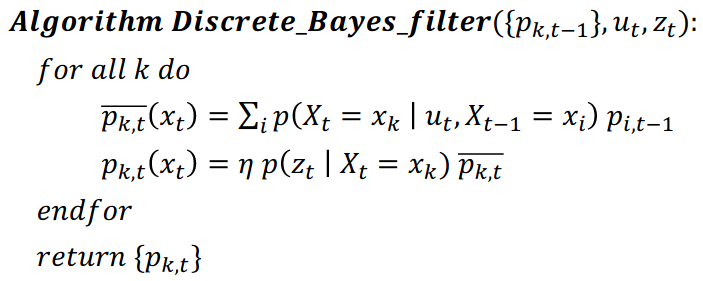
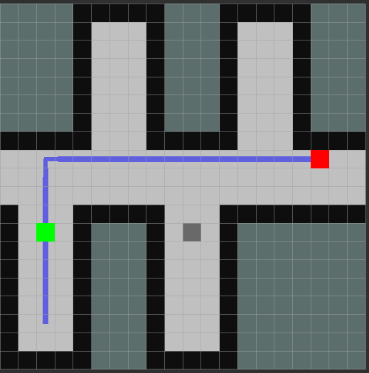

## Tutorial 03: Probability Theory & Localization

### Introduction

The creation of this package was part of the third exercise in the practical course 'Intelligent Mobile Robots with ROS' and is based on the topics of the third lecture.

The package contains a localization node that subscribes to the topics /move, /scan and /map and publishes to the topics /robot_pos, /visualization/robot_pos and /robot_pos_map. The localization node contains a discrete Bayes localization algorithm that publishes the most likely current state of the robot on the /robot_pos topic. This state is estimated based on a sensor and a motion model. The discrete Bayes algorithm can be split up in two steps. In the first step - the prediction step - the state gets 'forwarded' based on the movement probabilities of the motion model and the move command obtained from the /move topic. The second step - also known as update step - updates the probabilities based on the received measurement and normalizes the probabilities so that the sum of them is equal to one again. The discrete Bayes localization algorithm is depicted in Fig. 1.

<figure>
  
  <figcaption> <b>Fig.1:</b> Discrete Bayes algorithm</figcaption>
</figure> 

In order to visualize the most likely current robot position in rvis, the localization node publishes a green Marker on the topic /visualization/robot_pos. Furthermore, a OccupancyGrid that contains all possible robot states - not only the most likely one - gets published after each step of the discrete Bayes algorithm. The current most likely robot position, the path that is generated by a A-Star path planner and the goal are displayed in the figure below. This figure show not only the robots most likely state, but also states that are as likely or not as likely as the current most likely state (see gray cell in the parallel hallway). To depict not only the most likely state in rvis the topic /robot_state_map should be added to the rvis visualization.

<figure>
  
  <figcaption> <b>Fig.2:</b> Map with path and most likely robot state</figcaption>
</figure> 

A challenge that often occurs in mobile robotics is robot kidnapping. The algorithm implemented in the localization node should be able to cope with this challenge, because if the robot completely loses track of its state, the algorithm simply restarts the Bayes initialization process.

### Code Overview

The localization node was added to the navigation.launch launch file of the pcimr_navigation package. Therefore, all that is necessary to start all relevant nodes is to execute the following command after a ROS master has been started.

        roslaunch pcimr_navigation navigation.launch

For more details about the task have a look at the README.md of pcimr_tutorial_01.