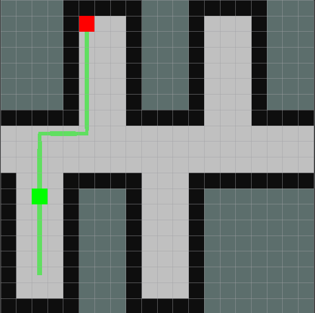

## Tutorial 05: Path Planning & Control

### Introduction

The creation of the a_star_planner node in this package was part of the fifth exercise in the practical course 'Intelligent Mobile Robots with ROS' and is based on the topics of the fifth lecture.

The a_star_planner node listens to the topics /map (discretized version of the map in form of an occupancy grid), /robot_pos (current robot position) and /move_base_simple/goal (goal published via the rvis '2D Nav Goal' function). The node estimates then a path based on the A-Star algorithm between its current position and the goal. For visualization purposes the goal and the estimated path are published on the topics /visualization/goal and /visualization/plan in the form of marker messages. Furthermore, the path gets also published on the topic /global_path, which is used by the robot_mover node to actually move the robot along the path to the goal. The figures 1 - 3 show three possible paths between different robot and goal positions to demonstrate the functionality of the a_star_planner node. In the visualizations the goal position is marked in red and the path and current robot position in green.

<table style="margin-left: auto; margin-right: auto; table-layout: fixed; width: 100%">
  <tr>
    <td style="width: 30%;"> </td>
    <td style="width: 30%;">  </td>
    <td style="width: 30%;"> </td>
  </tr>
  <tr>
    <td style="width: 30%;" valign="top"> <b>Fig.1:</b> Path Example 1 </td>
    <td style="width: 30%;" valign="top"> <b>Fig.2:</b> Path Example 2 </td>
    <td style="width: 30%;" valign="top"> <b>Fig.3:</b> Path Example 3 </td>
  </tr>
</table>

### Code Overview

The A-Star algorithm is a complete and optimal path search algorithm based on graphs. The explored nodes are stored in a priority queue until they are popped. The cost of the nodes, which is necessary for the priority queue, is estimated based on the following function:

f(n) = g(n) + h(n)

The first element of the sum, g(n), represents the cost from the start node to the actual node itself and h(n) a heuristics function which describes in our case the cost from the actual node to the goal node. In this exercise it makes the most sense to use the Manhattan distance for the calculation of the cost, since the robot is not allowed to move diagonal in our simple discretized grid world.

The a_star_planner node was added to the navigation.launch launch file of the pcimr_navigation package. Therefore, all that is necessary to start all relevant nodes is to execute the following command after a ROS master has been started.

        roslaunch pcimr_navigation navigation.launch

For more details about the task have a look at the README.md of the tutorial-05 branch.