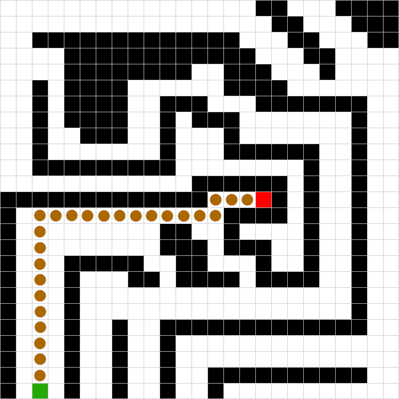

# Practical Course: Intelligent Mobile Robots with ROS (PCIMR)

## Tutorial 01: Linux, Software & ROS

### Introduction

The creation of this package was part of the first exercise in the practical course 'Intelligent Mobile Robots with ROS' and is based on the topics of the first lecture.

The package contains a simple path planner that sets the robot's initial position to (2,0) and makes the robot reach the goal that is located at the position (16, 12).

For better understanding please refer to Fig.1.

<figure>
  
  <figcaption>Fig.1 - Grid world with goal (red) and start (green)</figcaption>
</figure> 

  

### Code Overview

In order to run the simple path planner, which is implemented in the simple_planner_node in the pcimr_planner package, the following lines of code 
have to be executed in the terminal after launching a ros master with the command 'roscore':

    rosrun pcimr_simulation simple_sim_node

    rosrun pcimr_planner simple_planner_node.py

The simple_planner_node is subscribed to the topics /scan and /robot_pos and publishes commands to the topic /move. These commands can be 'E', 'W', 'S' or 'N', depending on
the data that has been acquired through the /scan topic. If the current position of the robot is equal to the goal position, the robot stops moving and the simple_planner_node terminates.

The logic behind this path planner is straightforward, since the robot basically only has to move north and east until the next possible position in the grid-world would be an occupied cell.
In the implementation of the algorithm the 'N' command has priority over the command 'E'. Therefore the robot would only move east if it is no longer possible to move north.

The path the robot would take in order to get to the goal is depicted in the Fig.2.

<figure>
  
  <figcaption>Fig.2 - Path marked in orange</figcaption>
</figure> 

At each time step the simple_planner_node logs its own position to the console. 

In order to make scripts in the package reliably run in Python 3.x, the shebang was changed to '#!/usr/bin/env python3'.

